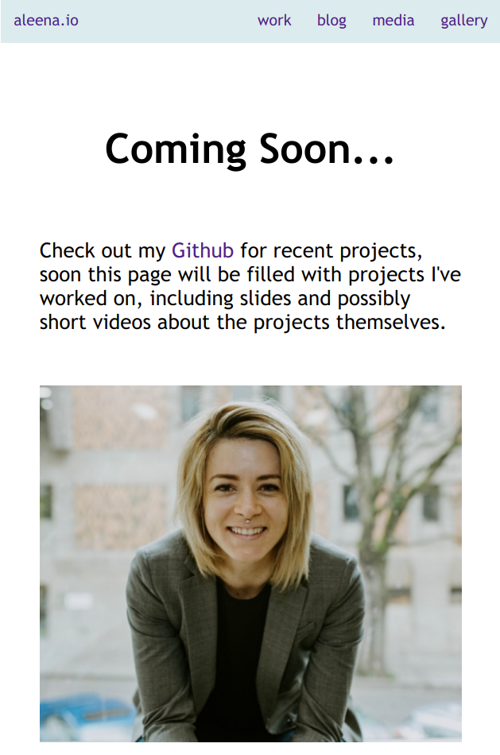

## aleena.io | v2
### Full stack website
Code for personal website aleena.io, tailored to general use, and multiple reuse. The goal of this project is to take recently learned skills of HTML/CSS/JS and apply it to a website already up and running. Previously, aleena.io was themed with grayscale Bootstrap template. 

### New Updates
Using templating with vanilla JavaScript, Node, and Express for back end, the result is a simple system that works to pull requested page and insert it into the <title> of a given HTML page. Content is inserted into the template.html file using regular expressions by finding string CONTENT and replacing it with the requested page's HTML. 

UI is now all done with CSS instead of Bootstrap. In the future this may change, but this was a design choice to help seal in knowledge rather than purley for esthetics.

TODOs:
1. Develop color scheme & migrate to Bootstrap (without template)
2. Background image for home page
3. Template blog & pull information from file (instead of hard coding it in)
4. Set up database for archiving blogs and running galleries
5. Comment section for blogs

And for the future, v3 will be written in React! However, I will keep this version here on Github for those who prefer this version over a React version.

## Technology Used
HTML/CSS/Vanilla JavaScript, Node, and Express. I host my website on a server I rent through Linode. 